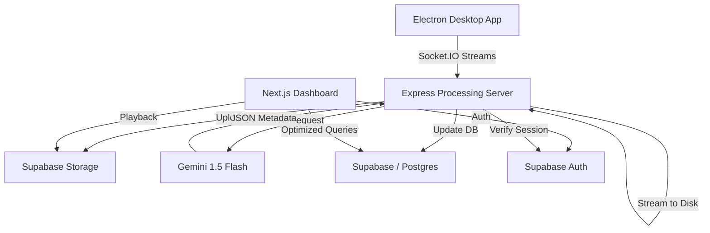

# 🪐 Vintyl — AI-Powered Video Sharing Platform

Vintyl is a high-performance async video communication platform, powered by **Supabase** (Auth, Database, Storage) and **Google Gemini AI**.

- **Live Web**: [https://vintyl.venusapp.in/](https://vintyl.venusapp.in/)
- **Webhook**: [https://vintyl.venusapp.in/api/payment/webhook](https://vintyl.venusapp.in/api/payment/webhook)


---

## ✨ Features

### Core Platform
- **High-Performance Recording** — Capture screen and audio with the Electron desktop app.
- **Real-time Streaming** — Video chunks are streamed directly to the Express processing server with backpressure handling for maximum stability.
- **Video Library** — Organize recordings into workspaces and folders with real-time scalar aggregations (`videoCount`).
- **Rich Previews** — Beautiful preview pages with view tracking, sharing controls, and nested comments.
- **Workspace Collaboration** — Invite team members with secure invitation flows and workspace-scoped RLS.

### AI-Powered (Gemini 1.5 Flash)
- **Auto Transcription** — Conversational speech-to-text conversion for every recording.
- **AI Summarization** — Automated generation of descriptive titles and concise summaries.
- **Processing Status** — Real-time feedback on AI enrichment progress.

### Security & Scalability
- **Unified Identity** — Secure JWT-based authentication across web and desktop.
- **Optimized RLS** — High-performance Row Level Security using `EXISTS` patterns and composite indexing.
- **Memory-Safe Processing** — Buffer-free streaming to disk prevents memory bloat during large uploads.

---

## 🏗 Architecture



---

## 🚀 Getting Started

### 1. Clone & Install
```bash
git clone https://github.com/YumiNoona/Vintyl.git
cd Vintyl
npm install
```

### 2. Environment Configuration
Create a `.env` file in the root directory.
Key variables required:
- `NEXT_PUBLIC_SUPABASE_URL`
- `NEXT_PUBLIC_SUPABASE_ANON_KEY`
- `SUPABASE_SERVICE_ROLE_KEY`
- `GEMINI_API_KEY`
- `STRIPE_SECRET_KEY`

### 3. Database Setup
Apply `FullDatabaseSchema.sql` to your Supabase SQL Editor. This initializes:
- Optimized tables with composite indexes.
- Provisioning triggers for new users.
- `update_video_count` triggers for high-performance aggregations.
- `Member`-based RLS policies for multi-tenant isolation.

### 4. Run the Platform

#### A. Web Frontend (Next.js)
```bash
npm run dev
```

#### B. Processing Server (Express)
```bash
cd express-server
npm install
node index.js
```

#### C. Desktop Recorder (Electron)
```bash
cd desktop
npm install
npm start
```

---

## 🛠 Tech Stack

| Layer | Technology |
|---|---|
| **Frontend** | Next.js 16, React Query, Lucide Icons, ShadCN UI |
| **Backend** | Express.js, Socket.IO (with Backpressure) |
| **Auth** | Supabase Auth (Shared JWT Token logic) |
| **Database** | Supabase (Postgres with Scalar Triggers) |
| **Storage** | Supabase Storage (`vintyl-videos` bucket) |
| **AI** | Google Gemini 1.5 Flash |
| **Desktop** | Electron (Desktop Media Capture) |
| **Payments** | Stripe |

---

## 📂 Project Structure

```
Vintyl/
├── src/
│   ├── actions/        # Server actions (Optimized queries, Auth sync)
│   ├── app/            # Next.js app router (Dashboard, Preview, Billing)
│   ├── components/     # UI components (Global, Dash, Recording)
│   ├── hooks/          # Custom hooks (Mutation data, Query data)
│   └── lib/            # Utilities (Supabase, Stripe, Gemini)
├── express-server/     # Express + Socket.IO stream processing
├── desktop/            # Electron desktop recorder
├── public/             # Static assets (Logos, Icons)
└── FullDatabaseSchema.sql # Optimized Supabase SQL initialization
```

---

## 📝 License
MIT
