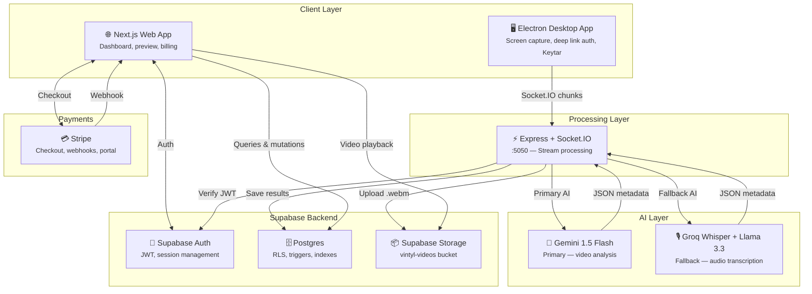
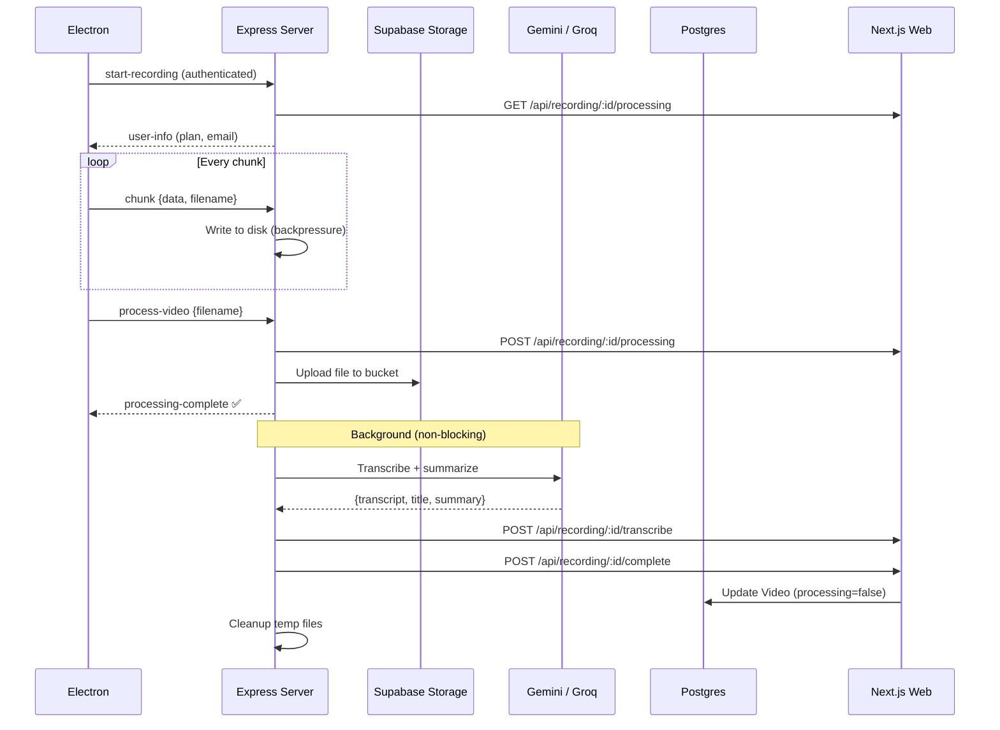
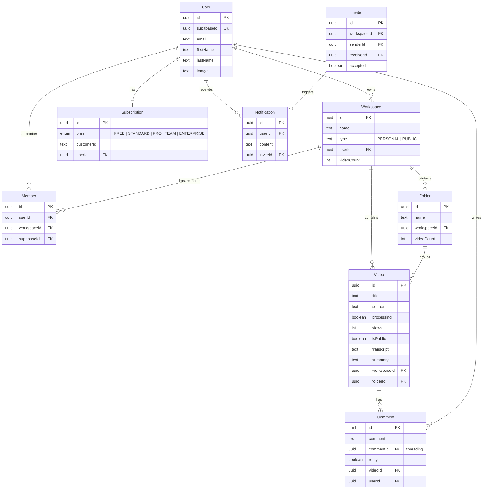

<div align="center">

# 🪐 Vintyl

### AI-Powered Async Video Communication Platform

Record your screen, enrich it with AI, and share with your team — all in one seamless workflow.

[](https://vintyl.venusapp.in/)
[](https://github.com/YumiNoona/Vintyl)


</div>

---

## 📖 Summary

Vintyl is a full-stack, production-grade video sharing platform designed for async team communication. It combines three independently deployable services — a **Next.js 16 web dashboard**, an **Express + Socket.IO processing server**, and an **Electron desktop recorder** — into a unified experience backed by **Supabase** and a **dual AI pipeline**.

**How it works:**
1. A user launches the Electron desktop app and authenticates via deep link (`vintyl://auth`).
2. The app captures the screen and streams video chunks over Socket.IO to the Express server with backpressure handling.
3. The Express server writes chunks to disk (memory-safe), uploads the final file to Supabase Storage, and kicks off AI enrichment in the background.
4. **Gemini 1.5 Flash** analyzes the full video (base64) to produce a transcript, title, and summary. If Gemini times out (15s), it falls back to **Groq Whisper** (audio transcription via ffmpeg extraction) + **Llama 3.3 70B** (summarization).
5. The enriched metadata is saved to Postgres and the video appears in the user's dashboard — organized by workspaces and folders, with view tracking, comments, sharing controls, and analytics.

**Multi-tenant by design** — workspaces are isolated via Row Level Security with `EXISTS`-based Member checks and composite indexes. Subscription tiers (FREE → ENTERPRISE) gate features like AI processing, video limits, member counts, and recording resolution.

---

## ✨ Features

### 🎥 Core Platform
| Feature | Description |
|---|---|
| **Screen Recording** | Capture screen + audio via Electron with source selection (screens & windows) |
| **Real-time Streaming** | Socket.IO with backpressure handling — no memory bloat on large uploads |
| **Video Library** | Workspaces → Folders → Videos with denormalized `videoCount` triggers |
| **Rich Previews** | Public preview pages with view tracking, embed codes, and share links |
| **Nested Comments** | Threaded comment system with self-referencing parent IDs |
| **Workspace Collaboration** | Invite members, accept invitations, workspace-scoped access control |

### 🤖 AI Pipeline
| Feature | Description |
|---|---|
| **Auto Transcription** | Full speech-to-text from video audio |
| **AI Title & Summary** | Automated generation of descriptive titles and 2-sentence summaries |
| **Dual Provider Fallback** | Gemini 1.5 Flash (primary) → Groq Whisper + Llama 3.3 70B (fallback) |
| **Plan-Gated Processing** | AI features controlled per subscription tier with daily thresholds |

### 🔐 Security & Auth
| Feature | Description |
|---|---|
| **Unified Identity** | Supabase Auth with shared JWT across web and desktop |
| **Desktop Deep Linking** | `vintyl://auth?token=X&userId=Y` protocol with Keytar secure storage |
| **Row Level Security** | 9 tables with `EXISTS`-based policies; service-role bypass for cross-member queries |
| **Rate Limiting** | Request throttling on sensitive endpoints |

### 💳 Payments
| Feature | Description |
|---|---|
| **Stripe Checkout** | Plan upgrade via hosted checkout sessions (PRO, TEAM) |
| **Webhook Integration** | Automatic subscription sync on successful payment |
| **Billing Portal** | Self-service plan management for existing subscribers |

---

## 🏗 Architecture



### Recording Data Flow



---

## 🛠 Tech Stack

| Layer | Technology | Purpose |
|---|---|---|
| **Frontend** | Next.js 16, React 19, TailwindCSS 4 | App router, SSR, server actions |
| **UI** | ShadCN UI, Framer Motion, Lucide Icons | Component library, animations, icons |
| **State** | React Query (TanStack), React Context | Server state caching, recording state |
| **Backend** | Express.js, Socket.IO | Real-time video chunk processing |
| **Auth** | Supabase Auth | JWT sessions, OAuth-ready |
| **Database** | Supabase Postgres | RLS, triggers, composite indexes |
| **Storage** | Supabase Storage | Video file hosting (`vintyl-videos`) |
| **AI (Primary)** | Google Gemini 1.5 Flash | Multimodal video analysis |
| **AI (Fallback)** | Groq Whisper + Llama 3.3 70B | Audio transcription + text summarization |
| **Desktop** | Electron, Keytar | Screen capture, secure token storage |
| **Payments** | Stripe | Subscriptions, webhooks, billing portal |
| **Forms** | React Hook Form, Zod | Validation and form management |

---

## 📂 Project Structure

```
Vintyl/
│
├── src/                                # ─── Next.js 16 Application ───
│   │
│   ├── actions/                        # Server Actions (data layer)
│   │   ├── ai.ts                       #   Gemini transcription, summary, processVideoWithAI
│   │   ├── auth.ts                     #   login, signup, logout
│   │   ├── payment.ts                  #   getSubscription, createCheckoutSession
│   │   ├── user.ts                     #   onAuthenticatedUser, profile, notifications, search
│   │   ├── video.ts                    #   getVideoDetails, comments, views, transcribe
│   │   └── workspace.ts               #   Workspace/folder/video CRUD, invites, members
│   │
│   ├── app/                            # Next.js App Router
│   │   ├── (website)/                  #   Landing page & marketing
│   │   │   ├── _components/navbar.tsx  #     Site navigation bar
│   │   │   ├── layout.tsx              #     Marketing layout wrapper
│   │   │   └── page.tsx               #     Homepage / hero
│   │   │
│   │   ├── api/                        #   API Route Handlers (10 routes)
│   │   │   ├── ai/route.ts            #     AI processing endpoint
│   │   │   ├── health/route.ts        #     Health check
│   │   │   ├── payment/webhook/       #     Stripe webhook handler
│   │   │   ├── recording/[id]/        #     processing, transcribe, complete
│   │   │   └── upload/                #     Direct upload + mock endpoint
│   │   │
│   │   ├── auth/                       #   Authentication Pages
│   │   │   ├── layout.tsx              #     Auth layout
│   │   │   └── AuthForm.tsx           #     Login / signup form
│   │   │
│   │   ├── dashboard/                  #   Main Application
│   │   │   ├── page.tsx               #     Dashboard redirect
│   │   │   └── [workspaceId]/         #     Workspace-scoped pages
│   │   │       ├── layout.tsx         #       Dashboard shell (sidebar + navbar)
│   │   │       ├── home/page.tsx      #       Video library grid
│   │   │       ├── activity/page.tsx  #       Activity feed & invite notifications
│   │   │       ├── billing/page.tsx   #       Subscription & plan management
│   │   │       ├── members/page.tsx   #       Workspace member management
│   │   │       ├── settings/page.tsx  #       User profile settings
│   │   │       ├── notifications/     #       Notification center
│   │   │       ├── record/page.tsx    #       Browser recording interface
│   │   │       └── folder/[folderId]/ #       Folder detail view
│   │   │
│   │   ├── desktop-auth/              #   Deep-link auth handler for Electron
│   │   ├── payment/                   #   Stripe checkout return page
│   │   ├── preview/[videoId]/         #   Public video preview + comments
│   │   ├── globals.css                #   Design tokens, typography system
│   │   └── layout.tsx                 #   Root layout (providers, fonts)
│   │
│   ├── components/                     # UI Components
│   │   ├── global/                     #   Shared application components
│   │   │   ├── navbar/                #     Top navigation bar
│   │   │   ├── sidebar/              #     Workspace sidebar navigation
│   │   │   ├── videos/               #     Video card grid & player
│   │   │   ├── folders/              #     Folder cards & navigation
│   │   │   ├── analytics/            #     Usage & view analytics
│   │   │   ├── search/               #     Global search (cmdk)
│   │   │   ├── modal/                #     Reusable modal wrapper
│   │   │   ├── share-modal/          #     Video sharing dialog
│   │   │   ├── embed-modal.tsx       #     Embed code generator
│   │   │   ├── loader/               #     Loading states
│   │   │   ├── workspace-content/    #     Workspace page content
│   │   │   ├── folder-content/       #     Folder page content
│   │   │   ├── how-to-post/          #     Tutorial/guide component
│   │   │   ├── voice-flow/           #     Voiceflow chatbot widget
│   │   │   ├── hero-visual.tsx       #     Landing page hero graphic
│   │   │   ├── recording-overlay.tsx #     Recording indicator overlay
│   │   │   └── global-recording-effects.tsx
│   │   ├── recording/                 #   Recording-specific UI
│   │   ├── theme/                     #   Theme provider (next-themes)
│   │   └── ui/                        #   ShadCN primitives (button, input, dialog, etc.)
│   │
│   ├── context/
│   │   └── RecordingContext.tsx        # Recording state provider
│   │
│   ├── hooks/                          # Custom React Hooks
│   │   ├── useBrowserRecorder.ts      #   Browser-based screen recording
│   │   ├── useGlobalShortcuts.ts      #   Keyboard shortcut handler
│   │   ├── useMutationData.ts         #   React Query mutation wrapper
│   │   ├── useQueryData.ts            #   React Query query wrapper
│   │   ├── useSearch.ts               #   Debounced search logic
│   │   ├── useZodForm.ts              #   Zod + React Hook Form integration
│   │   └── use-mobile.ts             #   Responsive breakpoint detection
│   │
│   ├── lib/                            # Utilities & Client Setup
│   │   ├── supabase/
│   │   │   ├── client.ts             #   Browser Supabase client (anon key)
│   │   │   ├── server.ts             #   Server client (anon) + system client (service role)
│   │   │   ├── admin.ts              #   Admin client for API routes (service role)
│   │   │   └── middleware.ts          #   Auth session refresh middleware
│   │   ├── stripe.ts                  #   Stripe instance
│   │   ├── storage.ts                 #   Storage helper utilities
│   │   ├── rate-limit.ts              #   Request rate limiting
│   │   ├── voiceflow.ts              #   Voiceflow chatbot config
│   │   └── utils.ts                   #   General utilities (cn, etc.)
│   │
│   ├── react-query/
│   │   └── index.tsx                  # QueryClientProvider setup
│   │
│   ├── types/
│   │   └── index.ts                   # Shared TypeScript interfaces
│   │
│   ├── constants/
│   │   └── index.ts                   # App-wide constants (routes, config)
│   │
│   └── shared/
│       └── planLimits.js              # CJS re-export for TS imports
│
├── express-server/                     # ─── Express Processing Server ───
│   ├── index.js                       #   Socket.IO server, AI pipeline, upload logic (344 lines)
│   ├── test_ai_pipeline.js           #   AI pipeline integration tests
│   └── package.json                   #   Dependencies (socket.io, @google/generative-ai, openai, ffmpeg-static)
│
├── desktop/                            # ─── Electron Desktop Recorder ───
│   ├── src/
│   │   ├── main.js                    #   Main process (window, IPC, deep linking, keytar)
│   │   ├── preload.js                 #   Context bridge (secure IPC exposure)
│   │   └── renderer/                  #   Frontend UI
│   │       ├── index.html             #     App shell
│   │       ├── app.js                 #     Recording logic, Socket.IO client, auth flow
│   │       └── styles.css             #     Desktop UI styles
│   ├── build/                         #   Electron build assets (icons)
│   └── package.json                   #   Dependencies (electron, keytar, socket.io-client)
│
├── shared/                             # ─── Shared Configuration ───
│   └── planLimits.js                  #   Plan tier limits (videos, members, AI, resolution, daily thresholds)
│
├── public/                             # ─── Static Assets ───
│   ├── vintyl-logo.svg               #   Vector logo
│   ├── vintyl-logo.png               #   Raster logo
│   └── favicon.png                    #   Browser favicon
│
├── FullDatabaseSchema.sql             # Complete Supabase SQL initialization
├── package.json                       # Root dependencies & scripts
├── next.config.ts                     # Next.js configuration
├── tsconfig.json                      # TypeScript configuration
├── components.json                    # ShadCN UI configuration
└── postcss.config.mjs                 # PostCSS + TailwindCSS 4
```

---

## 🗄️ Database Schema

### Tables (9)



### Triggers & Automation
- **`handle_new_user`** — Fires on `auth.users` INSERT: auto-provisions User → Subscription (FREE) → Personal Workspace → Member row.
- **`update_video_count`** — Fires on `Video` INSERT/DELETE: maintains denormalized `videoCount` on both Workspace and Folder.
- **Bootstrap Script** — Retroactively provisions all existing `auth.users` who pre-date the schema.

---

## 💰 Subscription Plans

| | FREE | STANDARD | PRO | TEAM | ENTERPRISE |
|---|:---:|:---:|:---:|:---:|:---:|
| **Videos** | 25 | 50 | ∞ | ∞ | ∞ |
| **Members** | 1 | 5 | 1 | 10 | ∞ |
| **AI Processing** | ❌ | ✅ | ✅ | ✅ | ✅ |
| **Transcription** | ❌ | ✅ | ✅ | ✅ | ✅ |
| **Max Resolution** | 720p | 1080p | 4K | 4K | 4K |
| **Daily AI Limit** | 0 | 20 | 100 | 500 | ∞ |

---

## 🚀 Getting Started

### 1. Clone & Install
```bash
git clone https://github.com/YumiNoona/Vintyl.git
cd Vintyl
npm install
```

### 2. Environment Configuration
Create a `.env` file in the root directory with these keys:

```env
# Supabase
NEXT_PUBLIC_SUPABASE_URL=your_supabase_url
NEXT_PUBLIC_SUPABASE_ANON_KEY=your_anon_key
SUPABASE_SERVICE_ROLE_KEY=your_service_role_key
DATABASE_URL=your_postgres_connection_string

# App
NEXT_PUBLIC_HOST_URL=http://localhost:3000

# AI
GEMINI_API_KEY=your_gemini_key
GROQ_API_KEY=your_groq_key

# Stripe
STRIPE_SECRET_KEY=your_stripe_secret
STRIPE_WEBHOOK_SECRET=your_webhook_secret
STRIPE_PUBLISHABLE_KEY=your_publishable_key
STRIPE_PRO_PRICE_ID=price_xxx
STRIPE_TEAM_PRICE_ID=price_xxx
```

### 3. Database Setup
Run `FullDatabaseSchema.sql` in the Supabase SQL Editor. This creates all tables, indexes, triggers, RLS policies, and bootstraps existing users.

### 4. Run the Platform

```bash
# Terminal 1 — Web Frontend
npm run dev                              # → localhost:3000

# Terminal 2 — Processing Server
cd express-server && npm install && node index.js   # → localhost:5050

# Terminal 3 — Desktop Recorder
cd desktop && npm install && npm start
```

---

## 🎨 UI Conventions

- **Typography**: Use semantic classes from `globals.css`: `text-display`, `text-page-title`, `text-section-title`, `text-subheading`, `text-body`, `text-body-sm`, `text-caption`, `text-eyebrow`.
- **Colors**: Use design tokens (`bg-background`, `text-foreground`, `bg-card`, `text-muted-foreground`) — never raw hex.
- **Font Weights**: Default to `font-medium` / `font-semibold`. Reserve `font-black` for hero usage only.
- **Layout**: Heading → supporting copy → content grid with consistent spacing rhythm.

---

## 📝 License

[](./LICENSE)

This project is licensed under the **MIT License** — see the [LICENSE](./LICENSE) file for details.
