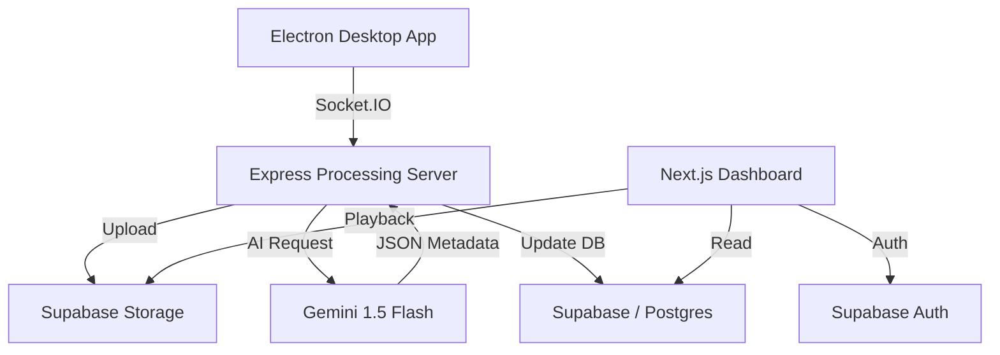

# 🪐 Vintyl — AI-Powered Video Sharing Platform

Vintyl is a high-performance async video communication platform, now powered entirely by **Supabase** for Auth, Database, and Storage.

- **Live Web**: [https://vintyl.venusapp.in/](https://vintyl.venusapp.in/)
- **Webhook**: [https://vintyl.venusapp.in/api/payment/webhook](https://vintyl.venusapp.in/api/payment/webhook)


---

## ✨ Features

### Core Platform
- **Screen Recording** — Captures screen/audio and streams to the cloud in real-time.
- **Video Library** — Organize videos into workspaces and folders.
- **Video Preview** — Rich preview page with view tracking, sharing, and comments.
- **Workspace Collaboration** — Invite team members and manage permissions.

### AI-Powered
- **Auto Transcription** — Google Gemini 1.5 Flash converts speech to text.
- **AI Summarization** — Generates titles and summaries for every video automatically.
- **Interactive Insights** — AI-generated content helps users understand recordings at a glance.

### Desktop App Linking
- **Unified Identity** — Link your desktop recorder to your web account using your unique **User ID**.
- **Real-time Streaming** — Desktop recordings are processed by the Express server and stored in Supabase.

### Monetization
- **3-Tier Pricing** — Free, Pro, and Team plans.
- **Stripe Integration** — Secure checkout sessions and billing portal.

---

## 🏗 Architecture



---

## 🚀 Getting Started

### 1. Clone & Install
```bash
git clone https://github.com/YumiNoona/Vintyl.git
cd Vintyl
npm install
```

### 2. Environment Configuration
Create a `.env` file in the root directory. Use `.env.example` as a template.
Key variables required:
- `NEXT_PUBLIC_SUPABASE_URL`
- `NEXT_PUBLIC_SUPABASE_ANON_KEY`
- `SUPABASE_SERVICE_ROLE_KEY`
- `GEMINI_API_KEY`
- `STRIPE_SECRET_KEY`

### 3. Database Setup
The database schema is managed directly in Supabase. Apply the `DBSchema.sql` to your Supabase SQL Editor to initialize the tables and the `handle_new_user` trigger.

### 4. Run the Platform

#### A. Web Frontend (Next.js)
```bash
npm run dev
```

#### B. Processing Server (Express)
```bash
cd express-server
npm install
node index.js
```

#### C. Desktop Recorder (Electron)
```bash
cd desktop
npm install
npm start
```

---

## 🛠 Tech Stack

| Layer | Technology |
|---|---|
| **Frontend** | Next.js 16, React Query, Tailwind CSS, ShadCN UI |
| **Backend** | Express.js, Socket.IO |
| **Auth** | Supabase Auth (Unified across Web & Desktop) |
| **Database** | Supabase (Postgres) |
| **Storage** | Supabase Storage (`vintyl-videos` bucket) |
| **AI** | Google Gemini 1.5 Flash |
| **Desktop** | Electron (Desktop Media Capture) |
| **Payments** | Stripe |

---

## 📂 Project Structure

```
Vintyl/
├── src/
│   ├── actions/        # Server actions (Auth, AI, Video, Workspace)
│   ├── app/            # Next.js app router pages
│   ├── components/     # UI components (Global, Dash, Auth)
│   ├── hooks/          # Custom React hooks
│   └── lib/            # Utilities (Supabase, Stripe, Gemini)
├── express-server/     # Express + Socket.IO processing server
├── desktop/            # Electron desktop recorder
├── public/             # Static assets
└── DBSchema.sql        # Supabase SQL initialization script
```

---

## 📝 License
MIT
